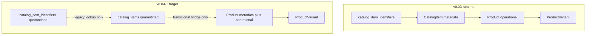
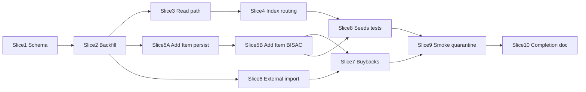

# v0.04-1 Product Fusion — Implementation Plan

**Status:** Ready for implementation / branch start

## Goal

Collapse catalog metadata onto **`products`** so active create/read/update flows never require `CatalogItem`. **`catalog_items` stays quarantined (Path B)** until v0.04-2; **`catalog_item_identifiers`** remain for legacy lookup only.

**Authoritative docs:** [spec.md](../docs/v0.04/v0.04-1-product-fusion/spec.md) · [data-model.md](../docs/v0.04/v0.04-1-product-fusion/data-model.md) · [test-plan.md](../docs/v0.04/v0.04-1-product-fusion/test-plan.md) · [delivery roadmap](../docs/roadmap/v0.04-delivery-roadmap.md)

## Current vs target



`catalog_item_identifiers` are **not** product identifiers in v0.04-1. They remain linked to quarantined `catalog_items` and are used only through the transitional bridge **`catalog_item_identifiers → catalog_items → linked products`** until v0.04-2 creates `product_identifiers`.

**Scale:** ~51 `app/` files reference `CatalogItem`/`catalog_item_id`; ~54 test files. Highest-impact files: `Items::IndexQuery`, `Items::ItemPresenter`, `AddItemController`, `ExternalCatalog::CatalogItemBuilder`.

---

## Path B bridge rules

`catalog_items` and `catalog_item_identifiers` remain in the database during v0.04-1, but they are **quarantined**.

**Allowed uses:**

- migration/backfill source data
- legacy identifier lookup bridge until v0.04-2 (`catalog_item_identifiers → catalog_items → products`)
- historical references on already-created records
- tests that verify migration behavior

**Disallowed uses:**

- creating new `CatalogItem` rows
- creating new `catalog_item_identifiers`
- rendering active item metadata from `CatalogItem`
- requiring `catalog_item_id` for product creation
- using catalog item as the Items workspace row grain

### `products.catalog_item_id` (Path B)

Keep `products.catalog_item_id` as a **deprecated transitional bridge** until v0.04-2 or v0.04-11.

- New product creation **must not set it**
- Runtime product display **must not depend on it**
- Legacy lookup may use it only in clearly named transitional services (e.g. duplicate detection bridge, migration helpers)

---

## Product metadata authority

After Slice 3, active item screens must treat **`products`** as authoritative for:

- title, creator/contributor display, publisher/manufacturer
- format, edition/release statement, description
- thumbnail/cover image
- series/subject display, physical metadata

Any catalog-item fallback retained during development must be **removed or documented** before v0.04-1 completion.

---

## New data prohibition

During v0.04-1, new staff/runtime flows must **not** create:

- `CatalogItem`
- `catalog_item_identifiers`

New flows create:

- `Product`
- `ProductVariant`
- transitional `products.sku` value if required by current constraints

---

## Hard boundaries (do not expand scope)

| In v0.04-1 | Deferred to |
| ---------- | ----------- |
| `product_identifiers`, validation families, ISBN alternates | v0.04-2 |
| Drop `catalog_items` / `catalog_item_identifiers` | v0.04-2 or v0.04-11 |
| POS/purchasing lookup full `product_identifiers` join | v0.04-4 |
| `product_groups`, demand, allocations | v0.04-3+ |

**Transitional identifier rule:** new products may cache a normalized value in `products.sku` (already unique/required). Existing POS lookup already tries `find_by_product_sku` before catalog identifiers.

---

## Recommended delivery slices

Work on branch `v0.04-1-product-fusion`. After each slice: `./dev/rails-docker bin/rails test` on touched areas; full suite before merge.

### Slice 1 — Schema foundation

**Migrations** — use timestamps **after the current latest migration on the branch**. Confirm with:

```bash
ls db/migrate | tail
```

Do not hardcode example timestamps; schema version in repo may differ from phase migration filenames.

1. **`add_product_metadata_to_products`** — add ~40 columns from data-model (`title`, `catalog_item_type`, `format_id`, JSONB blocks, physical fields, `store_category_id`, etc.); add indexes listed in data-model.
2. **`add_product_lookup_columns`** — confirm actual table/column names in `db/schema.rb` before migration. Target columns per data-model:
   - `external_lookup_results.local_product_id` (nullable FK → `products`)
   - `external_catalog_imports.product_id` (nullable FK → `products`)
   If naming differs from spec, follow existing external catalog/import conventions.
3. **Staged nullability** — add columns nullable first; tighten `title` presence after backfill.

**Product model prep** (`app/models/product.rb`):

- Move shared constants/enums from `CatalogItem` to `Product` or a `ProductMetadata` concern.
- Add `belongs_to :format`, `belongs_to :store_category`.
- Add `has_many :categorizations, as: :categorizable` — BISAC/category metadata currently reaches item screens primarily through catalog-item-backed sync paths; v0.04-1 makes **product categorizations authoritative** for active item screens.
- Keep `belongs_to :catalog_item, optional: true` for Path B; mark deprecated in comment.

**Tests:** migration smoke + `test/models/product_metadata_test.rb` after backfill.

---

### Slice 2 — Backfill + thumbnail fusion

1. **`backfill_product_metadata_from_catalog_items`** — per data-model backfill rules.
2. **`backfill_product_cover_images_from_catalog_thumbnails`** — catalog `primary_thumbnail` → product `cover_image` (1:1 mapping).
3. **`backfill_product_categorizations`** — repoint/copy `categorizations` from `CatalogItem` → linked `Product`.
4. **`backfill_external_lookup_product_ids`** — set product FK from legacy catalog item link (column name per schema).

Run verification queries from data-model § Data Migration Verification Queries.

**Tests:** backfill + thumbnail tests (test-plan §2.6).

---

### Slice 3 — Read path (Items workspace core)

Retarget presenters/resolvers to **product-authoritative** reads:

| File | Change |
| ---- | ------ |
| `Items::ThumbnailResolver` | Product `cover_image` becomes **authoritative**. Remove catalog fallback **after backfill verification**; if temporarily retained during this slice, delete before v0.04-1 completion. |
| `Items::ItemPresenter` | `from_product` primary; deprecate `from_catalog_item` |
| `Items::ItemOverviewPresenter` | Product metadata fields |
| `ProductNameRenderer` | Read product fields, not `catalog_item` |
| `Items::OperationalWarningBuilder` | Product-scoped warnings |
| `Items::VariantOperationalSnapshot` | Remove `product.catalog_item` chains |

**Tests first:** `thumbnail_resolver_test`, `item_presenter_test`, `product_name_renderer_test`.

---

### Slice 4 — Items index + routing

| File | Change |
| ---- | ------ |
| `Items::IndexQuery` | **Product-grain** browse/search (biggest refactor) |
| `ItemsController` | Prefer `product_id`; optional `catalog_item_id` → redirect |
| Views / `ItemsHelper` | Links use `product_id` |
| `CatalogItemsController` | Redirect/retire; identifier routes transitional until v0.04-2 |

**Tests:** `index_query_test`, `items_index_controller_test`, `items_items_controller_test`.

---

### Slice 5A — Add Item product-first persistence

Refactor `AddItemController` core create path:

- Session draft: `product_id` instead of `catalog_item_id`
- Create/update **Product** with metadata on wizard steps
- Assign transitional `products.sku` (normalized ISBN/UPC or placeholder per data-model)
- Create initial variant; **no `CatalogItem.create!`**

Extract if needed: `AddItem::PersistProduct`, `AddItem::BuildFromCandidate`.

**Tests:** `items_add_item_controller_test` (create path).

---

### Slice 5B — Add Item metadata helpers / BISAC sync

- Product-scoped BISAC sync (retarget `CatalogItemBisacSyncable` / `CatalogItemBisacSync`)
- Setup modals and preview/edit refinements
- Controller size cleanup

**Tests:** BISAC sync tests, `items_add_item_external_lookup_test`.

---

### Slice 6 — External catalog + Ingram import

Confirm schema column names before coding. Retarget:

- `ExternalCatalog::MetadataMapper` → product attributes
- `CatalogItemBuilder` → **`ProductBuilder`**
- `StagedCatalogItemBuilder` → staged product
- `DuplicateDetector` → products + legacy identifier bridge
- `PersistLookupResult` → product FK column
- `ExternalLookupController`, `IngramCatalogImport::Runner`

Identifier normalization via `CatalogIdentifierService` only; persistence to product fields/sku until v0.04-2.

**Tests:** `external_catalog/import_flow_test`, §3.5 lookup tests.

---

### Slice 7 — Buybacks

- `Buybacks::CreateIntakeItem` — product-first; no `CatalogItem.create!`
- `Buybacks::ResolveItem` — product sku/title + legacy identifier bridge
- Buyback line FK columns stay in schema; full retarget v0.04-4

**Tests:** `buybacks/create_intake_item_test`, integration smoke.

---

### Slice 8 — Seeds, fixtures, test helpers

- `db/seeds/phase3_catalog_products.rb` — products with metadata directly
- `test/support/phase3_test_helper.rb` — `create_product!` without mandatory catalog item
- `rails shelfstack:seeds:validate`

---

### Slice 9 — Quarantine legacy + operational smoke

1. Mark `CatalogItem` legacy/transitional
2. Static grep (test-plan §11)
3. POS / inventory / purchasing smoke
4. Full suite + optional system tests

---

### Slice 10 — Completion documentation

- `docs/implementation/v0.04-1-completion.md`
- Path B confirmation, transitional FK inventory, gaps for v0.04-2/4
- Update `AGENTS.md` → v0.04-2 when done

---

## Slice dependency graph



Slices 5A/6 can start after Slice 2; 5B after 5A; Slice 4 after Slice 3.

---

## Risk areas

1. **`Items::IndexQuery`** — highest regression risk
2. **BISAC categorizations** — polymorphic move + sync alignment
3. **Identifier gap** — `products.sku` + legacy bridge until v0.04-2
4. **Add Item** — split 5A/5B keeps diffs reviewable
5. **Permission keys** — document transitional `items.catalog_items.*`; do not rename in v0.04-1 unless necessary

---

## Definition of done checklist

Per test-plan §14 and spec § Definition of Done:

- Product metadata on `products`; backfill verified
- Add Item + external import create products without `CatalogItem`
- Items index/overview product-grain; `product_id` navigation
- Thumbnails from `cover_image` only (no catalog fallback at completion)
- Seeds validate; full test suite green
- Remaining `CatalogItem` usage documented as transitional
- Completion note written

---

## Suggested PR strategy

**Option A (recommended):** one branch, multiple commits per slice — easier to bisect.

**Option B:** stacked PRs (schema+backfill → read path → create flows) if review bandwidth is limited.
