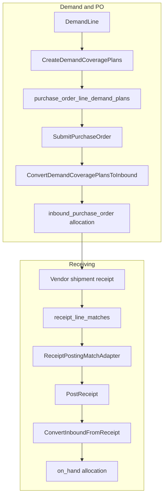

# v0.04-13 Implementation Plan

## Goal

Complete the **manual, non-EDI store-stock workflow** v0.04-12 started:

```text
Demand → sourcing → draft PO planned coverage → submit → inbound allocation
→ vendor shipment (multi-PO) → receipt matching → post → on-hand / pickup
```

Authoritative spec: [docs/v0.04/v0.04-13-demand-to-fulfillment-continuity/spec.md](docs/v0.04/v0.04-13-demand-to-fulfillment-continuity/spec.md), [data-model.md](docs/v0.04/v0.04-13-demand-to-fulfillment-continuity/data-model.md), [test-plan.md](docs/v0.04/v0.04-13-demand-to-fulfillment-continuity/test-plan.md).

**Merge gate:** all MVP slices A–H + `V00413_SLICE=final` verifier (no pending MVP checks) + v0.04-6–12 verifiers + golden-path acceptance test.

**Out of MVP merge:** readiness slices B/E2/R. Post-MVP work may not follow v0.04-13 immediately.

---

## Starting point (already in codebase)

| Area | Existing anchor |
|------|-----------------|
| Demand → PO bridge | [`Purchasing::DemandCoveragePlanner`](app/services/purchasing/demand_coverage_planner.rb), [`BuildPurchaseOrderFromDemand`](app/services/purchasing/build_purchase_order_from_demand.rb), [`AddDemandToPurchaseOrder`](app/services/purchasing/add_demand_to_purchase_order.rb) — audit-only planned coverage today |
| PO submit | [`Purchasing::SubmitPurchaseOrder`](app/services/purchasing/submit_purchase_order.rb) |
| Inbound alloc | [`DemandAllocations::AllocateInboundPurchaseOrder`](app/services/demand_allocations/allocate_inbound_purchase_order.rb) |
| Receipt post | [`Purchasing::PostReceipt`](app/services/purchasing/post_receipt.rb) + [`ConvertInboundFromReceipt`](app/services/demand_allocations/convert_inbound_from_receipt.rb) |
| Demand UX | [`Demand::DemandLineWorkflowPresenter`](app/presenters/demand/demand_line_workflow_presenter.rb) |
| PO demand display | [`Purchasing::PurchaseOrderLineDemandBreakdown`](app/services/purchasing/purchase_order_line_demand_breakdown.rb) — active allocations only |
| Verifier pattern | [`lib/shelfstack/v00412_verify.rb`](lib/shelfstack/v00412_verify.rb) + rake task |

[`DemandAllocation::ALLOCATION_KINDS`](app/models/demand_allocation.rb): extend with `vendor_direct_fulfillment` in D2 (schema/gates only — **no MVP path creates rows** until readiness E2).

---

## Architecture (MVP data flow)



**Invariant:** `purchase_order_line_demand_plans` never affect `InboundAvailability` until Slice E converts on submit/eligibility.

**PostReceipt rule:** consumes a **normalized receipt-posting view** from the adapter — does not branch on whether PO linkage came from legacy `receipt_lines.purchase_order_line_id` or new `receipt_line_matches`.

---

## Migration slice expectations (all migration-heavy slices)

Every migration slice must include:

- Default/backfill values for existing rows
- Model validation compatibility after migration
- Seed idempotency where applicable
- Verifier check promoted when slice merges (backfilled defaults present)

Applies especially to: `vendors` capabilities, `purchase_orders` ship_to_type/order_purpose, `receipts` origin/receiving_mode, `demand_allocations` allocation_kind enum.

---

## Incremental verifier strategy

**Slice 0:** Register all 15 MVP check names in [`lib/shelfstack/v00413_verify.rb`](lib/shelfstack/v00413_verify.rb) as `pending` / WARN (not FAIL).

**Each slice:** Promote its checks from pending → enforced when slice merges.

**Slice I / final:** No pending MVP checks remain; `V00413_SLICE=final STRICT=1` requires all PASS.

Readiness checks remain WARN until slices B/E2/R ship (`V00413_SLICE=readiness`).

---

## Slice 0 — Docs and verifier skeleton

**Deliver**

- Add v0.04-13 section to [docs/roadmap/v0.04-delivery-roadmap.md](docs/roadmap/v0.04-delivery-roadmap.md)
- Create `docs/implementation/v0.04-13-completion.md` stub
- Create [`lib/shelfstack/v00413_verify.rb`](lib/shelfstack/v00413_verify.rb) + rake task + test stub
- **All MVP check names registered as pending** (slice-aware: `slice_0|slice_a|slice_c|slice_d|slice_d2|slice_e|slice_f|slice_g|slice_h|final|readiness`)

**Acceptance:** `V00413_SLICE=slice_0` passes; pending checks WARN only.

---

## Slice A — Vendor capabilities

**Migration:** extend `vendors` (capability columns + backfill defaults).

**Code:** [`Vendor`](app/models/vendor.rb), `Vendors::CapabilityResolver`, Setup vendor form, seeds (reference wholesaler profile), audit `vendor.capability_updated`.

**Verifier:** promote capability column + enum checks.

**Tests:** model validation, resolver, seed idempotency, backfill defaults.

---

## Slice C — Sourcing next actions

**Migration:** capability snapshot columns on `sourcing_attempts`.

**Code:** `Sourcing::NextActionPresenter`, snapshot on submit, sourcing queue/detail labels.

**Verifier:** promote snapshot column checks.

**Tests:** presenter matrix; snapshot on submit.

---

## Slice D — Draft PO demand plans (no conversion)

**Migration:** `purchase_order_line_demand_plans` only (no PO destination columns yet — those land in D2).

**Code**

- `PurchaseOrderLineDemandPlan` model
- `Purchasing::CreateDemandCoveragePlans`, `UpdateDemandCoveragePlans`, `ReleaseDemandCoveragePlan`, `PurchaseOrderLineDemandPlanSummary`
- Wire into [`BuildPurchaseOrderFromDemand`](app/services/purchasing/build_purchase_order_from_demand.rb) / [`AddDemandToPurchaseOrder`](app/services/purchasing/add_demand_to_purchase_order.rb) — durable plans + audit events
- PO show: planned coverage (customer vs shelf)
- Draft PO qty reconciliation

**Do not implement inbound conversion in this slice.**

**Verifier:** promote demand plans table + no availability impact check.

**Tests:** plan creation, idempotency, **no `InboundAvailability` impact**, release rules.

---

## Slice D2 — PO destination gates

**Migration:** `purchase_orders.order_purpose`, `ship_to_type`, nullable `ship_to_snapshot`; extend `demand_allocations.allocation_kind` with `vendor_direct_fulfillment`.

**Gate rule:** MVP may recognize `vendor_direct_fulfillment` as an enum value, but **no MVP path creates a `vendor_direct_fulfillment` allocation row** unless readiness slice E2 is implemented.

**Code**

- PO validations (reject `mixed`); block customer-direct PO from `#receive` and receipt posting guards
- Demand-to-PO UI: `fulfillment_route` selector (default `inbound_to_store`)

**Verifier:** promote PO destination + customer-direct gate checks; enum present check.

**Tests:** receive/post blocked for customer-direct; mixed rejected; no vendor_direct rows created in MVP paths.

---

## Slice E — Inbound plan conversion

**Code**

- `Purchasing::ConvertDemandCoveragePlansToInbound` — `inbound_to_store` only; idempotent
- Hook from [`SubmitPurchaseOrder`](app/services/purchasing/submit_purchase_order.rb)
- **Remove or route** all ad hoc inbound allocation paths in [`BuildPurchaseOrderFromDemand#commit_inbound_allocations_if_eligible!`](app/services/purchasing/build_purchase_order_from_demand.rb) through `ConvertDemandCoveragePlansToInbound` — single conversion authority
- Update [`DemandLines::SupplySummary`](app/services/demand_lines/supply_summary.rb) / workflow presenter — **Planned on order** from plans
- Audit: `purchase_order_line_demand_plan.converted_to_inbound`

**Verifier:** promote inbound conversion + planned-vs-inbound checks.

**Tests:** draft no conversion; submit converts once; retry safe; customer-direct plans skipped.

---

## Slice F — Vendor-shipment receiving entry

**Migration:** receipt origin fields + backfill defaults.

**Code**

- Receipt model validations
- Entry paths (all normalize into the **same draft receipt model** before posting):
  - **Vendor shipment** without header PO
  - **Single PO** shortcut from PO show
  - **Direct** / unplanned receipt
- Header shipment fields on form

**Verifier:** promote receipt origin field checks.

**Tests:** three entry paths create valid drafts; backfill defaults; shared draft shape.

---

## Slice G — Receipt line matching and receipt posting adapter

**Migration:** `receipt_line_matches` (+ optional line trace columns).

**Code**

- `ReceiptLineMatch` model
- `Receiving::PoLineMatchCandidates`, `SuggestReceiptLineMatches`, `ApplyReceiptLineMatches`
- **`Receiving::ReceiptPostingMatchAdapter`** (or `ReceiptLinePoLineResolver`):
  - **Input:** receipt, receipt_lines, confirmed `receipt_line_matches`
  - **Output:** posting-ready PO-backed quantities grouped by `purchase_order_line_id`
- [`Purchasing::PostReceipt`](app/services/purchasing/post_receipt.rb) consumes adapter output only — no scattered match logic
- Match UI: suggest / confirm / override
- Audit: match lifecycle events

**Verifier:** promote multi-PO match checks.

**Tests:** multi-PO shipment; demand-priority sort; post atomicity; adapter normalizes legacy line PO id + matches.

**Risk:** highest receiving slice — adapter isolates complexity from v0.04-9 conversion path.

---

## Slice H — Demand impact preview

**Code:** `Receiving::ReceiptDemandImpactPreview`; extend [`Orders::ReceiptShowPresenter`](app/presenters/orders/receipt_show_presenter.rb).

**Tests:** pre-post preview; post confirmation customer-ready vs shelf.

---

## Slice I — Verifier final, golden path, docs

**Verifier:** all MVP checks enforced; zero pending.

**Golden-path acceptance test** (formal milestone artifact):

- Preferred: `test/system/v00413_store_stock_ordering_workflow_test.rb`
- Minimum: `test/integration/v00413_store_stock_ordering_workflow_test.rb`

**Scenario:**

```text
Demand captured
→ added to draft PO
→ planned coverage visible on PO line
→ PO submitted
→ inbound allocation created
→ vendor shipment receipt created without header PO
→ line matched to PO
→ receipt posted
→ inbound converts to on_hand
→ demand ready for pickup
```

**Docs:** complete completion note; update AGENTS.md, schema-reference, roadmap status.

---

## Readiness tier (optional — do not block MVP merge)

| Slice | Deliver |
|-------|---------|
| **B** | `external_references` + services |
| **E2** | `ConvertDemandCoveragePlansToVendorDirect`, `AllocateVendorDirectFulfillment` — **first path that creates vendor_direct rows** |
| **R** | `ship_to_snapshot` submit validation, `FulfillVendorDirect`, `receipt_cartons` |

Schedule TBD; may follow other roadmap work before vendor integration.

---

## PR sequence (six PRs)

| PR | Slices | Purpose |
|----|--------|---------|
| **PR1** | 0 + A + C | Verifier skeleton (all checks pending); vendor capability; sourcing labels |
| **PR2** | D | Durable draft PO demand plans only — no conversion |
| **PR3** | D2 + E | PO gates; inbound conversion; supply state; remove ad hoc inbound paths |
| **PR4** | F | Shipment-first receipt entry (three paths → same draft model) |
| **PR5** | G | Matching + `ReceiptPostingMatchAdapter` + PostReceipt integration |
| **PR6** | H + I | Preview; golden-path test; verifier final; docs |

Readiness slices as separate PRs when scheduled.

---

## Key risks and mitigations

| Risk | Mitigation |
|------|------------|
| D+D2+E domain risk in one merge | Split PR2 (plans) vs PR3 (conversion) |
| `PostReceipt` + matches complexity | `ReceiptPostingMatchAdapter`; PostReceipt consumes normalized view |
| Accidental vendor_direct rows in MVP | Explicit gate: enum only until E2 |
| Verifier only useful at end | Incremental check promotion per slice |
| Supply state regression | Golden-path test + v00412 regression |
| Migration drift | Backfill + verifier per migration slice |

---

## Definition of done (MVP)

Per [spec.md](docs/v0.04/v0.04-13-demand-to-fulfillment-continuity/spec.md): golden-path test passes; `V00413_SLICE=final STRICT=1` all PASS; customer-direct gated; no retired v0.03 tables; completion note records **next roadmap priority TBD**.
