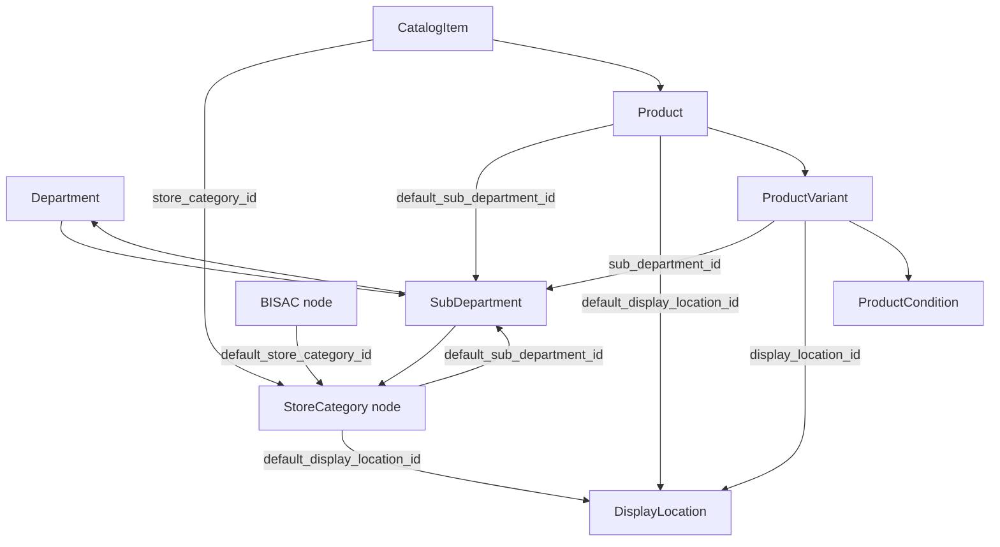

# Classification Target Spec

## Purpose

This document records **decisions and implementation plan** for ShelfStack’s classification architecture after Phase 3 and Phase 3B.

It replaces overlapping guidance in earlier Phase 3B issue drafts where those documents conflict with decisions captured here. During implementation, treat this file as the source of truth for classification semantics, naming, default resolution, and migration phasing.

Related:

* [transitional-domain-mapping.md](../roadmap/phase-3-rework-merchandise-classification-structure/transitional-domain-mapping.md) — historical Phase 3B transition notes (partially superseded)
* [00-epic-phase-3-rework-merchandise-classification-structure.md](../roadmap/phase-3-rework-merchandise-classification-structure/00-epic-phase-3-rework-merchandise-classification-structure.md)
* [domain-model.md](../domain-model.md)
* [phase-2-classification-and-tax-spec.md](phase-2-classification-and-tax-spec.md)

---

## Status

| Item | Decision |
| --- | --- |
| Roll back Phase 3 catalog/products/variants | **No** — continue from current branch |
| Roll back only legacy classification wiring | **Evolve in place** via phased migration |
| Effective date | Planning document; implementation not yet complete |

---

## Summary

ShelfStack is moving from a single overloaded **category** concept to a **multi-axis classification model**:

```text
Department
  = top-level reporting; GL account (for now)

Subdepartment
  = mid-tier reporting + operational defaults

Store Category
  = catalog-level topic / shelving classification (catalog items only)

Display Location
  = physical merchandising / findability in the store

Product / Product Variant
  = store-facing shell and sellable SKU truth
```

**Core principle:** each layer answers one business question. Do not use display location, store category, or condition as direct GL/tax drivers.

---

## Why the model is changing

Phase 2 `categories` combined too many meanings:

* operational defaults (tax, margin, pricing),
* implied reporting,
* sometimes topic or shelving meaning.

Phase 3B introduced `MerchandiseClass`, `CategoryScheme` / `CategoryNode`, and `AccountingMapping`, which separated concerns but added naming overlap.

This target spec **completes** that separation with stable names and clearer attachment points:

* **`sub_departments`** — operational behavior (rename from `merchandise_classes`)
* **`category_nodes`** in a **`store_categories`** scheme — store topic tree (rename from `store_sections_topics`)
* **`display_locations`** — unchanged in code
* **Phase 2 `categories`** — retire from item flows after migration

---

## Target classification spine

### 1. Departments

**Question:** “At the highest level, where should this roll up for reporting?”

**Responsibilities:**

* top-level sales reporting
* **GL / sales account export (for now)** via `departments.gl_account_code`
* broad navigation in setup

**Not responsible for:** item-level topic, physical shelf location, detailed inventory rules, variant-level tax overrides.

**Examples:** Books, Media, Periodicals, Sidelines, Cafe, Gift Cards, Services.

---

### 2. Subdepartments

**Question:** “What default business rules apply to this merchandise type?”

**Responsibilities:**

* mid-tier reporting (below department)
* default inventory tracking method
* used buyback eligibility
* default tax category
* default margin target
* default pricing model and supplier discount (operational costing)
* **`default_variation_type`** — product setup hint only (`standard`, `conditional`, `variable`, `matrix`)
* other operational flags as needed (`has_list_price`, vendor returnability, etc.)

**Not responsible for:** store topic/shelving taxonomy, physical placement, direct GL mapping (deferred; see GL section).

**Examples:**

```text
Books > General Trade
Books > Used / Buyback
Books > Bargain / Remainder
Cafe > Coffee / Espresso Beverages
Tracking > Gift Cards / Certificates
```

**Code naming:**

| Layer | Name |
| --- | --- |
| Table | `sub_departments` |
| Model | `SubDepartment` |
| FK | `sub_department_id` |
| Stable key | `sub_department_key` |
| UI / docs | “Subdepartment” |

**Migration note:** rename existing `merchandise_classes` → `sub_departments`; map `merchandise_class_key` → `sub_department_key`.

---

### 3. Store categories

**Question:** “What is this item about from the store/catalog merchandising point of view?”

**Responsibilities:**

* hierarchical topic / shelving-area classification
* default subdepartment suggestion
* default display location suggestion
* reporting and filtering by customer-facing class (catalog-linked items)

**Not responsible for:** tax behavior, GL posting, buyback rules, inventory method (those come from subdepartment via defaults).

**Attachment rule (decided):**

* Store category lives **only on `catalog_items`** via `store_category_id`.
* Only **catalog items and their child products/variants** participate in store categories.
* **Non-catalog products** have **no store category**; **subdepartment is the highest classification layer** for those items.

**Tree implementation (decided):**

* Do **not** create a separate `store_categories` table.
* Use existing **`category_schemes` + `category_nodes`**.
* Rename scheme purpose/key in seeds and UI: `store_sections_topics` → **`store_categories`**.

**Store category node fields (new / planned):**

```text
category_nodes.parent_id
category_nodes.default_sub_department_id
category_nodes.default_display_location_id
```

**Examples:**

```text
Fiction
History > U.S.
Children's Books > Ages 9–12
Newsstand > Magazines > Weeklies
```

**Code naming:**

| Layer | Name |
| --- | --- |
| Scheme key | `store_categories` |
| Catalog FK | `catalog_items.store_category_id` |
| UI / docs | “Store category” |

---

### 4. Display locations

**Question:** “Where is this physically displayed, stored, or merchandised?”

**Responsibilities:**

* physical / promotional placement in the store
* variant- and product-level placement overrides

**Not responsible for:** reporting category, tax, margin, buyback, subdepartment selection.

**Naming (decided):** keep existing code names:

* table: `display_locations`
* model: `DisplayLocation`
* FKs: `display_location_id`, `default_display_location_id`

UI copy may say “store location” or “shelving area”; schema stays `DisplayLocation`.

---

## Catalog vs non-catalog

| Path | Store category | Subdepartment |
| --- | --- | --- |
| Catalog item → product → variant | `catalog_items.store_category_id` | variant **`sub_department_id` required**; product may hold defaults |
| Non-catalog product → variant | none | variant **`sub_department_id` required**; highest classification layer |

---

## BISAC and additional schemes

**Decided:**

* **BISAC** remains its own **`CategoryScheme`** (`scheme_key: bisac`).
* BISAC nodes gain **`default_store_category_id`** → a node in the **`store_categories`** scheme.
* BISAC aids catalog setup; it is **not** the sellable operational classification.
* Additional subject/category schemes may be added later using the same `CategoryScheme` / `CategoryNode` pattern.

**Flow:**

```text
User selects BISAC on catalog item
  → optional: BISAC.default_store_category_id suggests catalog_items.store_category_id
  → store category defaults flow to product
  → variant gets final sub_department_id (condition may override suggestion)
```

**Keep `categorizations` for BISAC ↔ catalog item** (and future subject schemes). **Retire** store-section `categorizations` on **variants** after `catalog_items.store_category_id` is live.

---

## Product and variant behavior

### Product defaults (catalog-linked)

Inherited from store category when product is created from catalog:

```text
catalog_items.store_category_id
  → store_category.default_sub_department_id     → products.default_sub_department_id
  → store_category.default_display_location_id   → products.default_display_location_id
  → sub_department.default_variation_type          → product.variation_type (hint, not enforced)
```

### Variant sellable truth (decided)

**`product_variants.sub_department_id` is required** at save time (after migration Phase D).

Variant also carries:

* `condition_id` — descriptive + pricing + **report dimension**
* `display_location_id` — physical placement override
* optional future overrides (tax, inventory) — defer unless needed

**Why variant stores subdepartment:** one product can produce variants with different operational classes (new vs used vs remainder) while sharing one catalog item and store category.

### Condition

**Decided:**

* Condition is **not** a GL mapping dimension.
* Condition supports **department-level reporting**: department totals, or department totals **broken down by condition**.
* Condition also **suggests** subdepartment at variant creation (e.g. used → Used subdepartment, remainder → Bargain subdepartment).

### `default_variation_type` vs buyback

**Decided — keep separate:**

| Field | Meaning |
| --- | --- |
| `sub_departments.buyback_allowed` | operational buyback eligibility |
| `sub_departments.default_variation_type` | product structure hint at creation |

Do **not** use `buyback_allowed` to imply `conditional` variation type.

---

## GL and reporting

### GL (decided for now)

**Keep GL at the department level:**

```text
variant → sub_department → department → departments.gl_account_code
```

Subdepartments own **operational defaults**, not sales account export, until a future phase says otherwise.

**Implication:** `AccountingMapping` and per-subdepartment `default_sales_account_code` are **not** the near-term posting path. Freeze or simplify `AccountingMapping`; do not expand it unless department-level GL proves insufficient.

### Reporting dimensions

Sales reporting should support (future POS / reporting phase):

| Dimension | Use |
| --- | --- |
| Department | top-level rollups; GL alignment (for now) |
| Condition | optional slice within department |
| Subdepartment | operational / mid-tier analysis |
| Store category | merchandising analysis (catalog-linked items) |
| Display location | operational / floor planning |

---

## Default resolution order

Implement via explicit services (extend `ClassificationDefaultsResolver` pattern):

### Subdepartment (variant)

```text
1. user-supplied variant.sub_department_id
2. condition-based suggestion (used / remainder → appropriate subdepartment)
3. product.default_sub_department_id
4. catalog store category default_sub_department_id (catalog path only)
5. required — block save if missing (Phase D)
```

### Display location (variant)

```text
1. user-supplied variant.display_location_id
2. product.default_display_location_id
3. catalog store category default_display_location_id (catalog path only)
```

### Store category (catalog item)

```text
1. user-supplied catalog_items.store_category_id
2. BISAC node default_store_category_id (suggestion)
3. manual assignment required before sellable setup (policy TBD)
```

### Operational defaults (tax, margin, inventory method, buyback, pricing model)

```text
1. explicit variant overrides (where implemented, e.g. pricing_model_override)
2. variant.sub_department defaults
3. (future) product-level overrides if added
```

### GL (for now)

```text
variant.sub_department.department.gl_account_code
```

Every resolved value should be **explainable** (“Source: Subdepartment default from Books > General Trade”).

---

## Design rules

1. **Store category is not tax behavior** — it suggests subdepartment; it does not set tax directly.
2. **Display location is not classification** — never drive tax, margin, buyback, or GL from display location.
3. **Product defaults are suggestions** — variants carry final sellable classification.
4. **Variant is sellable truth** — POS, inventory, and operational reporting operate at variant level.
5. **Defaults must be explainable** — show source in UI where practical.
6. **Catalog-only store categories** — non-catalog items use subdepartment as top layer.
7. **Do not overload subdepartments** — document each field’s job; avoid recreating Phase 2 category overload.

---

## Mapping from current codebase

| Current | Target |
| --- | --- |
| `departments` | `departments` (unchanged role; GL stays here for now) |
| `merchandise_classes` | **`sub_departments`** (rename) |
| Phase 2 `categories` | **retire** from item flows; bridge during migration only |
| `category_schemes` (`store_sections_topics`) | scheme **`store_categories`** |
| `category_nodes` (store scheme) | **store category** nodes |
| `category_schemes` (`bisac`) | unchanged; add `default_store_category_id` on nodes |
| `catalog_items` | add **`store_category_id`** |
| `product_variants.category_id` | replace with **`sub_department_id`** |
| variant store-section `Categorization` | **retire**; topic moves to catalog item |
| BISAC `Categorization` on catalog | **keep** |
| `display_locations` | **unchanged** |
| `AccountingMapping` | **freeze / simplify**; not primary GL path |

---

## What we are not doing

* Full rollback of Phase 3 catalog, products, variants, identifiers, Add Item, Ingram, BISAC linking
* Renaming `display_locations` → `store_locations` in schema
* Creating a parallel `store_categories` table (use `category_nodes` + scheme)
* Condition-based GL mapping tables (for now)
* Subdepartment-level GL export (for now)
* Using `buyback_allowed` as a proxy for `conditional` variation type

---

## Migration plan

Phased migration **A → D**. Do not big-bang drop `category_id` and variant topic categorizations in one release.

### Phase A — Add schema (no user-facing behavior change)

Add columns / rename table:

```text
merchandise_classes → sub_departments (rename table + model)
sub_department_key  (rename from merchandise_class_key)

catalog_items.store_category_id

category_nodes.default_sub_department_id
category_nodes.default_display_location_id
category_nodes.default_store_category_id   (BISAC nodes)

products.default_sub_department_id
product_variants.sub_department_id         (nullable initially)
```

Keep during Phase A:

* `product_variants.category_id`
* variant store-section `Categorization`
* BISAC `Categorization` on catalog items

Rename seeds/scheme key: `store_sections_topics` → `store_categories` when seeding store category tree.

### Phase B — Backfill

| From | To |
| --- | --- |
| `variant.category → merchandise_class` | `variant.sub_department_id` |
| primary store-section categorization on variant | `catalog_item.store_category_id` (via product.catalog_item) |
| store category defaults | `product.default_sub_department_id`, `product.default_display_location_id` |
| non-catalog variants | `sub_department_id` from category → merchandise class mapping |

Seed BISAC → store category suggestions via `default_store_category_id` on BISAC nodes.

### Phase C — Switch UI and imports

* **Catalog edit:** store category tree picker
* **Product from catalog:** inherit store category defaults onto product
* **Variant forms:** subdepartment picker (replace Phase 2 category picklist)
* **Non-catalog Add Item:** subdepartment only (no store category)
* **Ingram import:** store category on catalog item; subdepartment on variant
* **BISAC picker:** suggest store category from `default_store_category_id`

Dual-read: if `sub_department_id` blank, fall back to `category.merchandise_class` until Phase D.

Prefill display location when store category changes (client + server fallback), using `default_display_location_id` on store category nodes.

### Phase D — Retire legacy

* `product_variants.sub_department_id` **NOT NULL**
* stop writing store-section categorizations on variants
* deprecate `product_variants.category_id` (nullable, then remove)
* hide Phase 2 **Categories** from item entry flows
* update lifecycle checks (`missing_category` → missing subdepartment / store category as appropriate)
* freeze or remove unused `AccountingMapping` behavior tied to old category model

---

## Entity relationship (target)



---

## Examples

### New trade book (catalog)

```text
Catalog item: store_category = Fiction
Store category defaults: subdepartment = Books > General Trade, display = Salesfloor > Books

Product: inherits defaults
Variant (New): sub_department = Books > General Trade
GL (for now): Books department gl_account_code
Report: Books department, condition = New
```

### Used copy, same catalog item

```text
Catalog item: store_category = Fiction (unchanged)
Variant (Used Good): sub_department = Books > Used / Buyback (condition-suggested)
GL (for now): per Used subdepartment’s department (or same Books dept — policy via dept tree)
Report: Books by condition = Used
```

### Cafe latte (non-catalog)

```text
No store category
Product: default_sub_department = Cafe > Coffee / Espresso Beverages
Product: variation_type = variable (from subdepartment hint)
Variants (S/M/L): sub_department = Cafe > Coffee / Espresso Beverages
```

### Gift card (non-catalog)

```text
No store category
Variant: sub_department = Tracking > Gift Cards / Certificates
inventory_behavior = pure_financial
```

---

## Open items (minor — decide during implementation)

| Item | Notes |
| --- | --- |
| Store category required before sellable? | Recommend yes, or explicit “Unclassified” node |
| One store category per catalog item? | **Yes** (single FK) |
| Cafe reporting scheme | Keep separate reporting scheme until POS; not same as store category |
| Department list finalization | e.g. Used Books as top-level dept vs subdepartment only |
| Pop TSV reference seed stash | **Done (initial):** `db/seeds/data/*.tsv` + `TsvTreeImporter`; expand toward full 175-node fidelity in a later pass |
| Product-level tax/inventory overrides | Defer unless needed |

---

## Implementation checklist

Use this as a working checklist for engineering issues:

- [x] Migration: rename `merchandise_classes` → `sub_departments`
- [x] Migration: add `catalog_items.store_category_id`
- [x] Migration: add store category node default FKs
- [x] Migration: add BISAC `default_store_category_id`
- [x] Migration: add `products.default_sub_department_id`, `product_variants.sub_department_id`
- [x] Backfill scripts / seed updates
- [x] Rename scheme `store_sections_topics` → `store_categories`
- [x] Services: subdepartment suggestion from condition
- [x] Services: extend default resolution / explain sources
- [x] UI: catalog store category picker
- [x] UI: variant subdepartment picker (replace category)
- [x] UI: store category → display location prefill (server-side via `StoreCategoryDefaults` / `CatalogItemStoreCategorySync`)
- [x] Ingram import updates
- [x] Retire variant store-section categorizations
- [x] Retire `product_variants.category_id`
- [x] Tests and seed idempotency
- [x] Update `domain-model.md` after Phase D

---

## Final statement

ShelfStack’s classification model is a **multi-axis system**, not a single category hierarchy:

```text
Departments report (and GL for now).
Subdepartments define operational behavior.
Store categories classify catalog topics and suggest defaults.
Display locations describe physical placement.
Product variants carry the final sellable subdepartment truth.
```

Preserve the Phase 3 spine **Catalog Item → Product → Product Variant**. Complete the classification rework by renaming and rewiring around that spine—not by restarting it.
